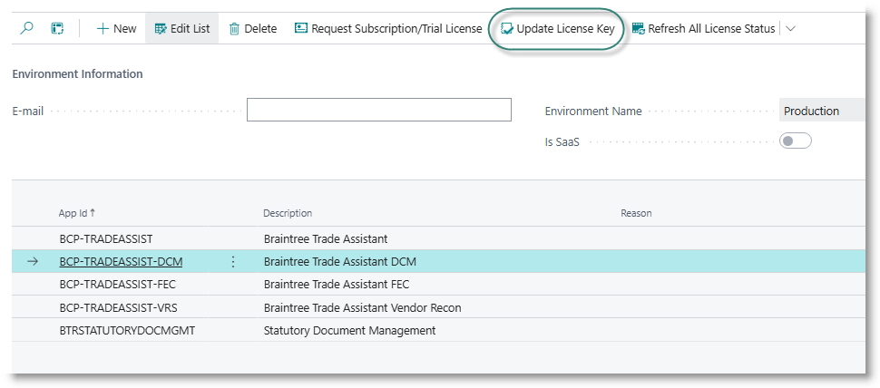
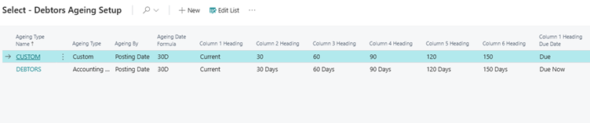
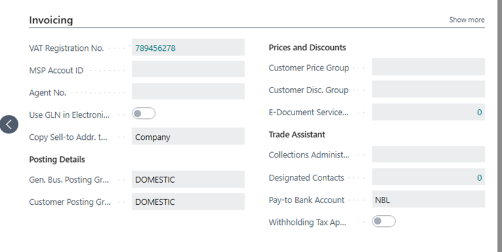

# Configure Debtors Collections

## Geting Started
- [Installing from Appsource](#installing-from-appsource)
- [How to request a licence registration key](#how-to-request-a-licence-registration-key)
- [Number Series](#number-series)
- [Ageing Setups](#ageing-setups)
- [Deduction Codes](#dispute-reasons)
- [Updating Customer]()

## Installing from Appsource
Open your Microsoft Dynamics Business Central tenant.
Search for Extension Management.
From the extension management page, select 'AppSource Gallery'. This may take a minute or two to open.
Search for Braintree.
Select 'Braintree Trade Assistant'.
Click on Install App:

After the app has installed, the setup page will open. The first thing you need to do is request a licence key.

## How to request a licence registration key
From the Trade Assistant Setup page.
From the menu bar, select 'Register App':

From the list of apps, select 'BCP-TRADEASSIST-DCM', then select 'Request Subscription / Trial licence' from the menu bar:

An email will be sent to the Braintree service desk. Once the request has been registered, a support consultant will send you a registration key. On the subscription request page, click on 'Update Licence Key':

Enter the key provided in the input box, and click OK.

## Number Series

On installation, the system will create a new number series and insert it in the setup table. You can edit this if required.

## Ageing Setups
Ageing Setup: used to define default settings and column headings on the collection dashboard.
Select Ageing Setup from the menu.
Add at least one setup definition:
- Code: enter a code to identify the setup.
- Ageing Type: select Accounting Period, Custom, or Calendar month
- Ageing By: select Document Date, Posting Date, or Document Date
- If using Custom ageing, enter a date formula to define the length of the periods eg 30D
- Enter appropriate column headings for each ageing bucket.

 

## Dispute Reasons
From the Trade Assistant Setup, click on Deduction Codes in the menu.
The Reason Codes page will be displayed.
Add new codes as required.
Tick the field ‘Dispute Reason’ for those codes that will be applicable to Debtors collection.

## Updating Customers
For each customer, set up the collections administrator for the account.
Open the customer card.
Go to the Invoicing tab.
In the section labelled ‘Trade Assistant’. 
In the field ‘Collections Administrator’, select a user name.

