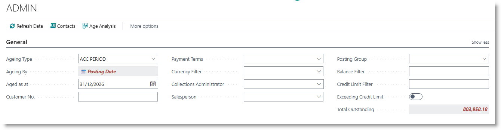
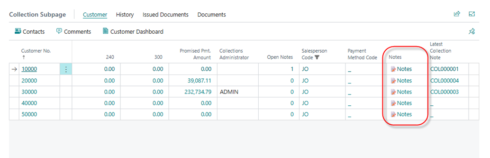
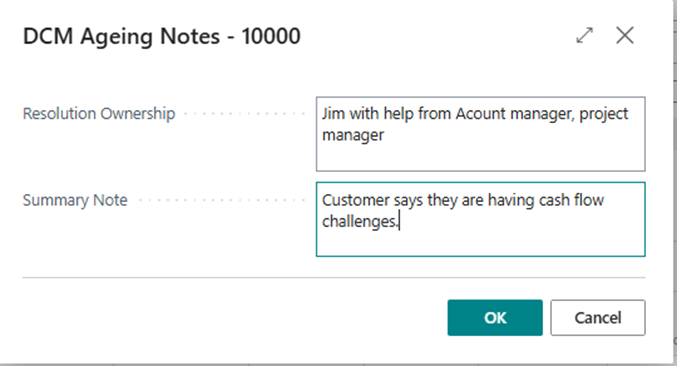
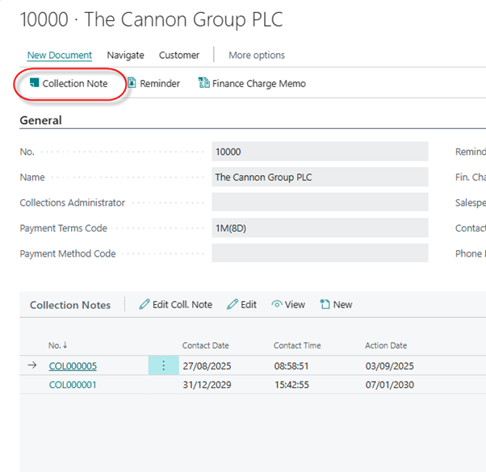
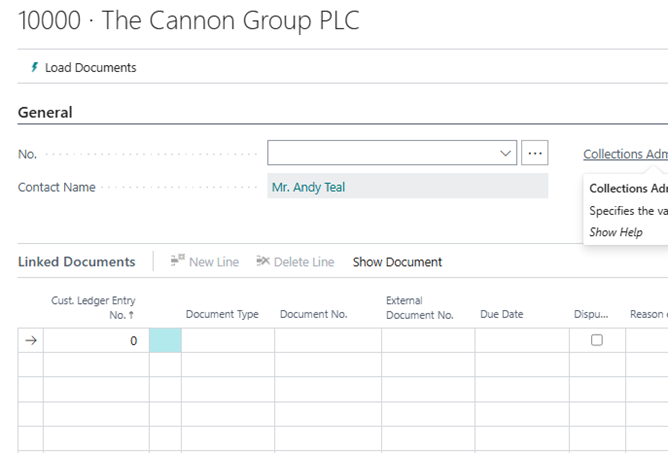
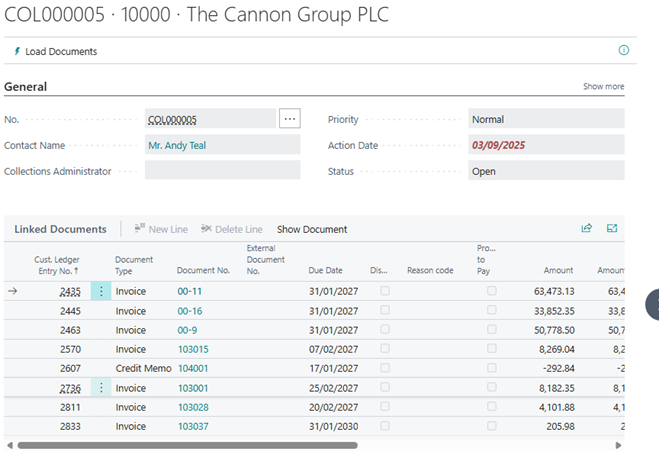
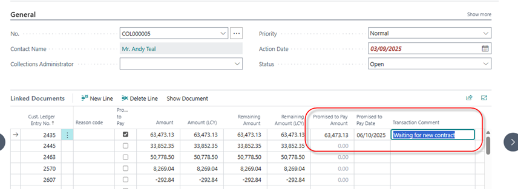

# Debtors Collection Dashboard
Search for 'Debtors Collection', and select the page.
It's a good idea to bookmark the page.

The dashboard will open.

## Select Dashboard Options

- Select an ageing type from the dropdown.
- Aged as at: enter the date at which you wish age outstanding invoices.

Optionally, enter one or more filters:
- Customer
- Salesperson
- Collections administrator
- Overdue

The parameters and filters selected will be remembered and reapplied the next time the user opens the page.

The total balance and the aged balances allow drill-down to the underlying transactions making up the balance.

## Capture notes on the customer
You can capture information about the state of the customer's account, and who is dealing with it.
Scroll to the right hand side of the customer list.
Click on ‘Notes’:

 
In the dialog box, capture details of the person / people involved in resolving collection issues on the customer, and capture a summary note for the customer. This note applies to the customer as a whole, and will appear on the Age Analysis.

 

This note applies to the customer as a whole, and will appear on the Age Analysis.

## Collection notes
Collection notes are used to record specific notes and expected payment dates against individual invoices. To record this information, the user must create a Collection Note. 

From the Collection Dashboard, select a customer.
Click on the customer name, or click on the Customer Dashboard menu option:

 
The customer’s dashboard will appear. This lists all Collection notes produced for the customer, with the most recent at the top.

Click on ‘Collection Note’ in the top menu bar:

 
A new collection note will be opened.

Press Tab to move off the No. field. The system will insert a document number.
Click on ‘Load Documents’.

The list of open invoices will be loaded.  You may need to refresh the page to see them.

 

Against each document, you can record information about the status of the document:

- Dispute: tick on this column to indicate that the customer is disputing the invoice.
- Reason Code: select a reason for the dispute from the drop down list.
- Promise to pay: tick on this column to indicate the customer has promised to pay the invoice. When you do this, the column ‘Promised to Pay Amount’ will be populated with the outstanding amount on the invoice, and ‘Promised to Pay Date’ will be populated with the default next contact date. These columns can be edited if necessary.
- Transaction comment: you can enter additional information or feedback from the customer.

 
The comments will be printed on the custom age analysis.

