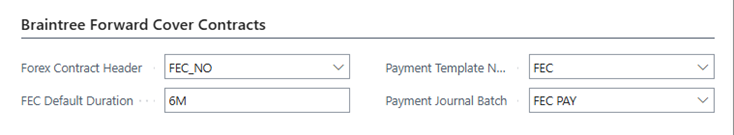
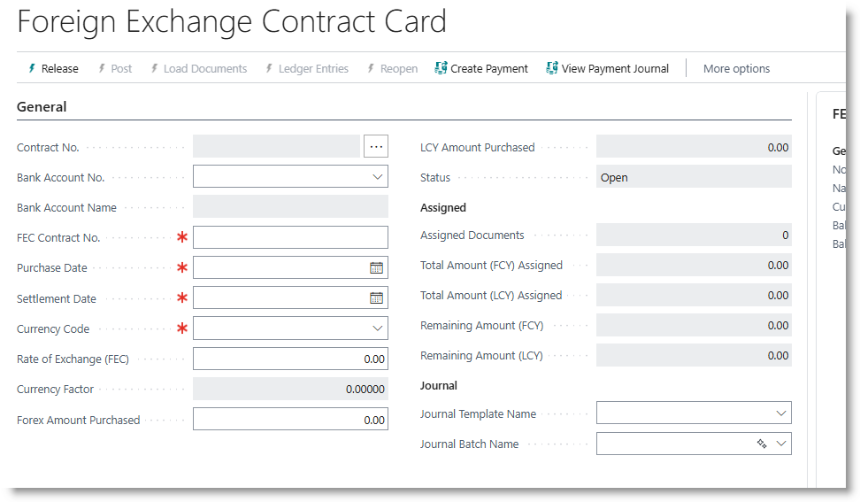

# Forward Exchange Contracts

The Forward Exchange Contracts module is a tool to assist importers to manage their foreign currency exposures on purchases. It provides options to reduce the risk posed by undpredictable exchange rates, improve cash flow forecasting and provide more accurate costing on imported inventory.

It is suitable for businesses that rely heavily on imported inventory

## Configuration and Setups
Go to Trade Assistant Setup.

On installation, the system will have created 
- a number series for FEC contracts.
- a default FEC duration of 6 months
- a payment journal template and batch.

## Creating contracts
Search for FEC Contracts, and click on the link to open the list.
From the list, click on New to create a new contract.

Select a bank account from the drop down. The system will allocate a contract number.
Complete the required information in the header:

| Field Name | Content |
|---|---|
| FEC Contract No. | The document number issued by the bank |
| Purchase Date | The date on which the contract was purchased|
| Settlement date|    | Will be set by adding the default expiry period to the purchase date, amend if required|
| Currency code| Defaults to the bank's currency; amend if necessary |
| Rate of Exchange | Defaults to system exchange rate. Change to the rate of the contract|
| Forex Amount Purchased | The value of the contract |

