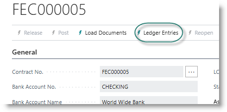
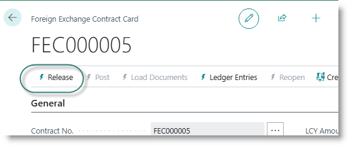
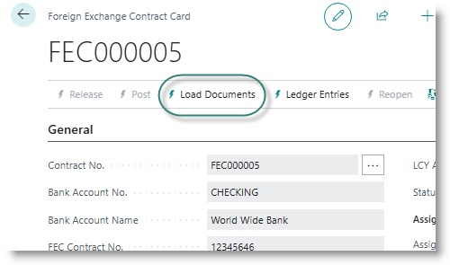
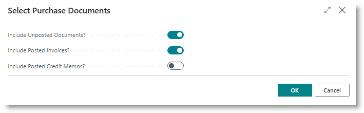
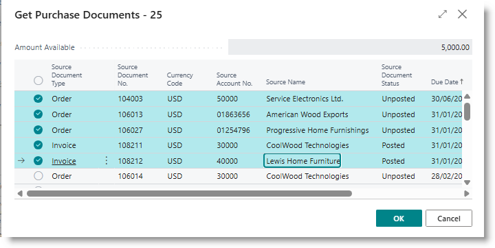
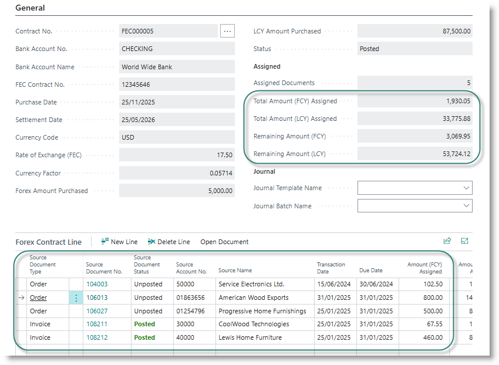
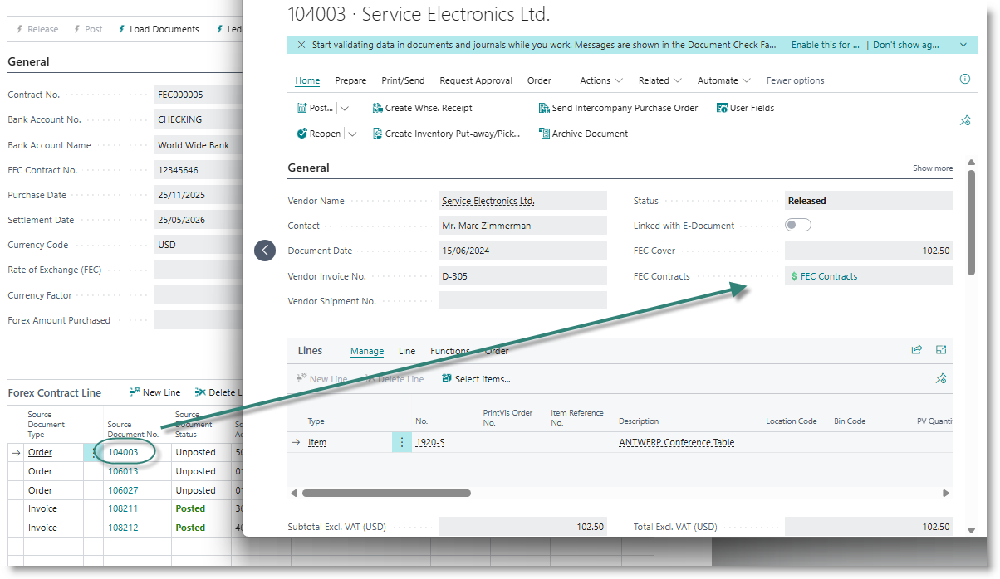
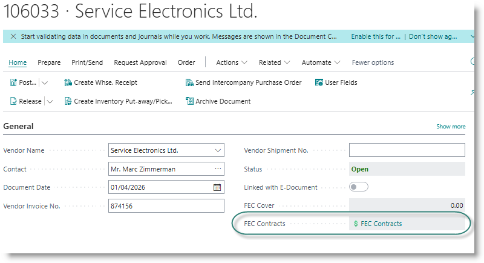

# Forward Exchange Contracts

The Forward Exchange Contracts module is a tool to assist importers to manage their foreign currency exposures on purchases. It provides options to reduce the risk posed by undpredictable exchange rates, improve cash flow forecasting and provide more accurate costing on imported inventory.

It is suitable for businesses that rely heavily on imported inventory

## Configuration and Setups
Go to Trade Assistant Setup.

On installation, the system will have created 
- a number series for FEC contracts.
- a default FEC duration of 6 months
- a payment journal template and batch.

## Creating contracts
**Capture the Contract Details**
Search for FEC Contracts, and click on the link to open the list.
From the list, click on New to create a new contract.

Select a bank account from the drop down. The system will allocate a contract number.
Complete the required information in the header:

| Field Name | Content |
|---|---|
| FEC Contract No. | The document number issued by the bank |
| Purchase Date | The date on which the contract was purchased|
| Settlement date|    | Will be set by adding the default expiry period to the purchase date, amend if required|
| Currency code| Defaults to the bank's currency; amend if necessary |
| Rate of Exchange | Defaults to system exchange rate. Change to the rate of the contract|
| Forex Amount Purchased | The value of foreign exchange purchased, in the currency of the contract |

The system will calculate the value of the contract in local currency, as per the following example:

**Release and Post the Contract**
Click on 'Release' in the menu bar.

The FEC header will no longer be editable. You can re-open the contract at this point, if you need to change anything. If you are happy with the contract, click on 'Post'. This will create an entry in the FEC ledger, recording the exact value of the contract. The entries can be viewed under 'Ledger Entries'.

**Load Purchase Documents from Contract**
To load multiple purchase orders, invoices or credit memos from the contract, click on 'Load Documents'. (This option will not be available until the contract has been posted.)

From the dialog, select the document types that need to be included. (By default, orders and invoices will be included.) Click OK.

A list of available documents in the currency of the contract will be presented. To appear on the list, the document must have been released, and must have a due date on or before the expiry date of the contract.
Highlight the documents you want to load onto the contract, and click OK.

The documents will be connected to the contract, and appear in the lines of the contract card. The balance of the contract will be updated:

You can review the documents by clicking on the Source Document No. The document page will open.
The field 'FEC Contract' shows the value covered by FEC contracts.

**Link a purchase document to a Contract**
From a purchase order or invoice, you can link the document to one or more open contracts of the same currency as the purchase.
- Create a new purchase document
- Assign a foreign currency to the document
- Capture the document lines.
- Click on 'FEC Contracts'.

    

- The FEC Assignment page will open. Click in the Contract No. field, and use the lookup button to select a contract from the list.
  
    

- In FEC Assignment List page, select a FEC contract from the lookup. The FEC and document will now be connected.
- If the contract has insufficient value to cover the document, you can select additional contracts as required.
  
**Post a receipt for a FEC-linked purchase order**
Purchase orders which are linked to a contract can be received using standard BC functionality - either via the purchase order, or via a warehouse receipt.

Goods will be received to stock using the applicable FEC exchange rate. If there are multiple contracts attached to the order, the exchange rate will be averaged.

After posting the receipt, the status of the document on the Contract changes to 'Received', and a new entry is added to the Contract ledger:

**Post an invoice for a FEC-linked purchase order**
A purchase invoice can be posted from the purchase order using standard BC functionality. After posting, the status of the document on the contract changes to 'Posted'. If the order was separately received beforehand, this value will be reversed in the ledger and replaced with the invoice:

**Post an invoice linked to FEC**
An invoice not associated with a purchase order is posted in the normal way. An entry will be added to the ledger.

**Modifying FEC assignments**
Unposted orders and invoices can be removed from a contract, and assigned to a different contract.

