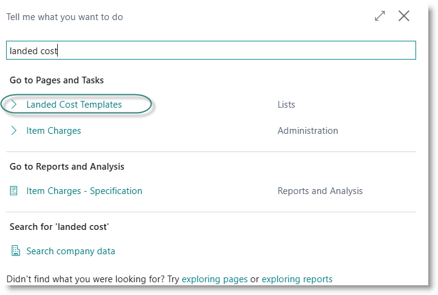
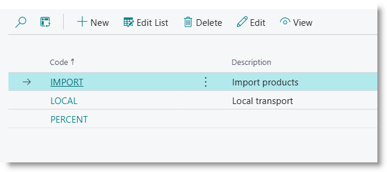
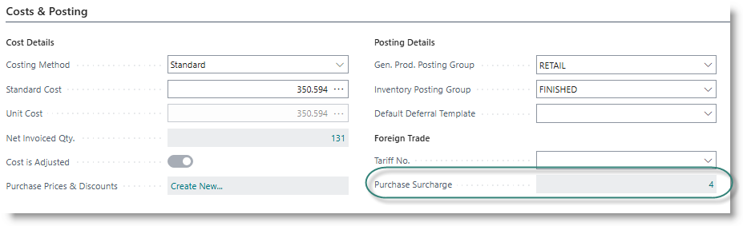
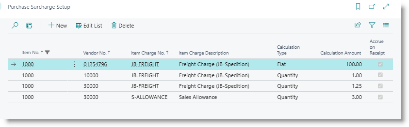

# Landed Cost
Products which are purchased for resale or for production may attract surcharges such as freight, import duties, inspection fees. Some of these costs may only be finalised weeks or months after the product has been received into the business. This can lead to stock items being incorrectly costed, and to selling prices being too high or too low.

The Landed Cost module of Trade Assistant provides tools to incorporate interim estimates for all supplimentary costs into the purchase cost of goods before the service providers' invoices have been processed, and to accrue for the costs in the general ledger.

## Configuration and Setup

### Item Charges
Supplimentary costs are defined under the Item Charges table. The table allows you to specify a preferred supplier for each defined charge. :

### Landed Cost Templates
Landed cost templates are used to define groups of item charges that should be applied to when buying certain products. After definition, the template can be attached to an item, or added on a purchase line.

Search for 'Landed Cost Template':

Click on New to create a new template. 

Go to the item list, and open the item card. Enter a code and description, and tick on 'Apply to Purchase'.

For each item charge to be applied, enter a line:

| Field | Value |
| Charge Item | Select an option from the dropdown. |
| Accrue on Receipt | Tick ON if you want the charge to accrue when primary product is received |
| Calculation Type | Select: Flat / Percent / Quantity |
| Calculation Amount | The rate to be applied to an order line | 

On the 'Costs and Purchasing' tab, drill down on the field 'Purchase Surcharge':

This will open a list of defined surcharges for the item.

Charges can be differentiated by primary supplier (the supplier from whom the product is purchased).
Click on 'Edit List' and complete the details:

| Field  | Content |
| Vendor No. | The primary supplier's vendor number|
| Item charge no. | The code of the supplimentary surcharge which will be applied |
| Calculation Type | **Flat** indicates a single flat fee per purchase|
|                  | **Percent** indicates that cost is calculated as a percentage of the product cost |
|                  | **Quantity** indicates that cost is calculated on quantity of product bought|
| Calculation Amount | The price per unit, or percentage, or flat fee to apply |
| Accrue on Receipt  | Indicates that the interim estimate will be accrued to general ledger when the product is received|

## Create landed costs on purchase orders

## Accrue costs on purchase receipts

## Posting landed cost invoices

[**⬆️ Back to Top**](#landed-cost) &nbsp;&nbsp;&nbsp;&nbsp; [**🏠 Home**](/trade_assistant)