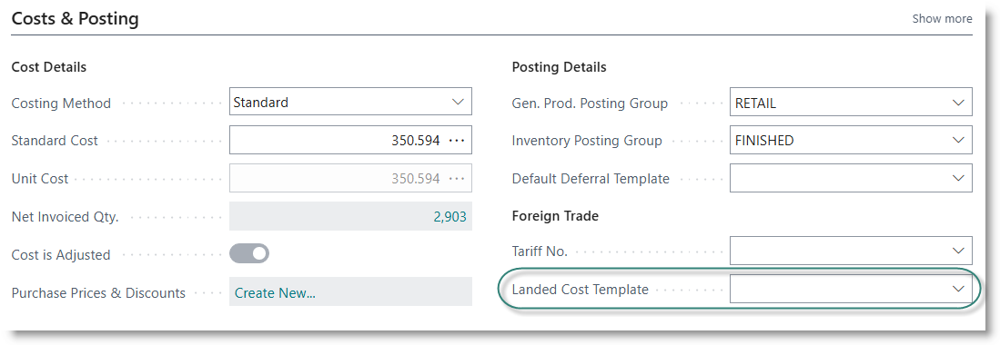

# Landed Cost - Configuration and Setup

- [Item Charges](#item-charges)
- [Landed Cost Templates](#landed-cost-templates)
- [Attach landed costs to items](#attach-landed-cost-templates-to-items)

### Item Charges
Supplementary costs are defined under the Item Charges table. The table allows you to specify a preferred supplier for each defined charge. :

  

### Landed Cost Templates
Landed cost templates are used to define groups of item charges that should be applied to when buying certain products. After definition, the template can be attached to an item, or added on a purchase line.

Search for 'Landed Cost Template':

  

  

Click on New to create a new template. 

Go to the item list, and open the item card. Enter a code and description, and tick on 'Apply to Purchase'.

  

For each item charge to be applied, enter a line:

| **Field**          | **Value** |
| Charge Item        | Select an option from the dropdown. |
| Accrue on Receipt  | Tick ON if you want the charge to accrue when primary product is received |
| Calculation Type   | Select: Flat / Percent / Quantity |
| Calculation Amount | The rate to be applied to an order line | 

On the 'Costs and Purchasing' tab, drill down on the field 'Purchase Surcharge':

This will open a list of defined surcharges for the item.

### Attach Landed Cost Templates to Items
If you attach a landed cost template to an item, it will be automatically activated when you use the item on a purchase order.

Go to Items. Open the item card.

On the Costs and Posting tab, select the field 'Landed Cost Template', and select an option from the dropdown:

[**⬆️ Back to Top**](#landed-cost---configuration-and-setup) &nbsp;&nbsp;&nbsp;&nbsp; [**🏠 Home**](/trade_assistant)