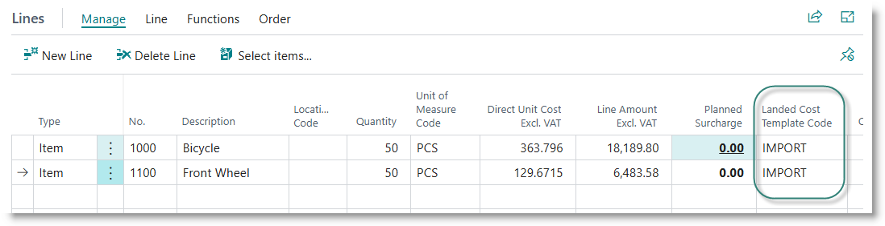
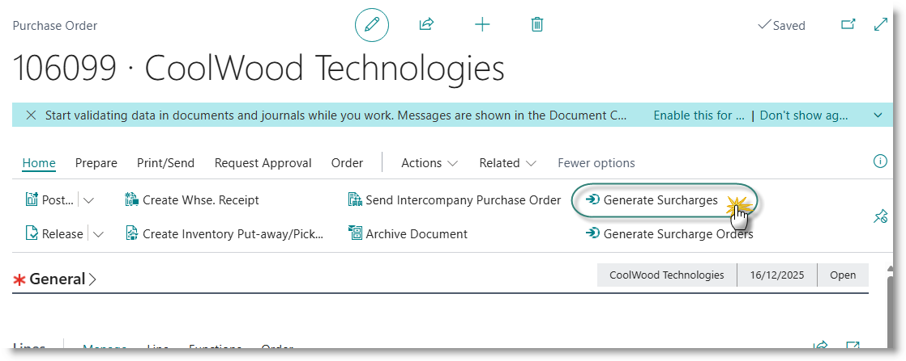
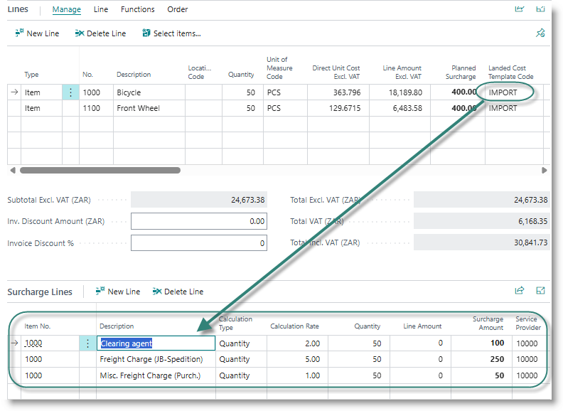
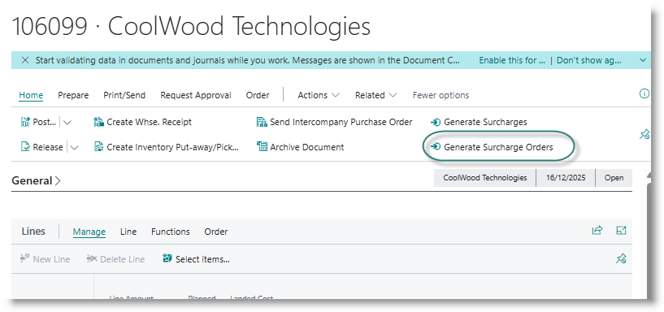
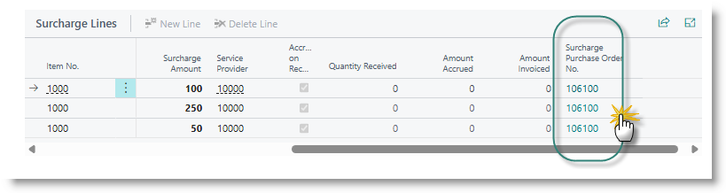
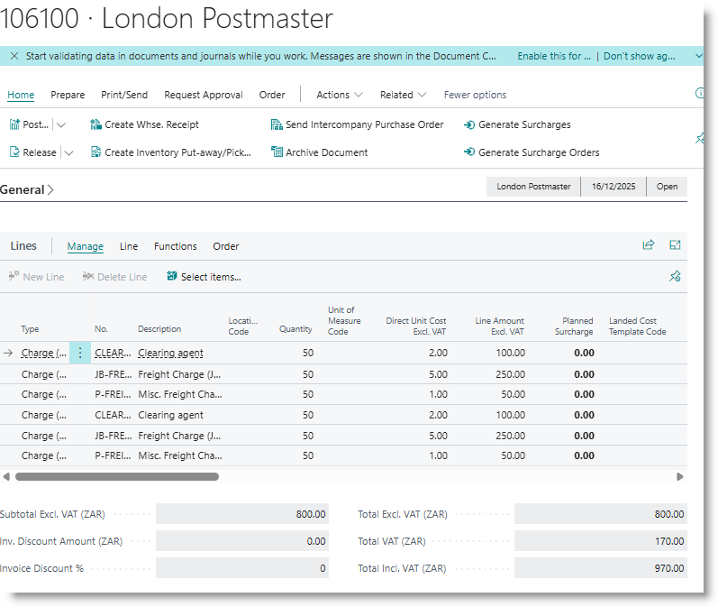
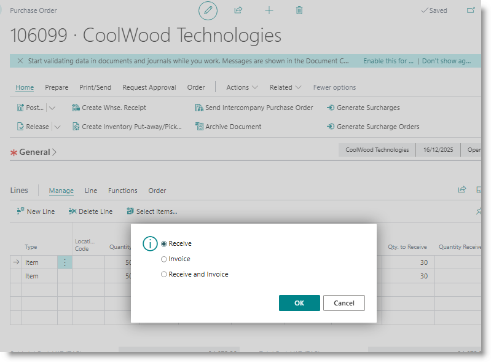
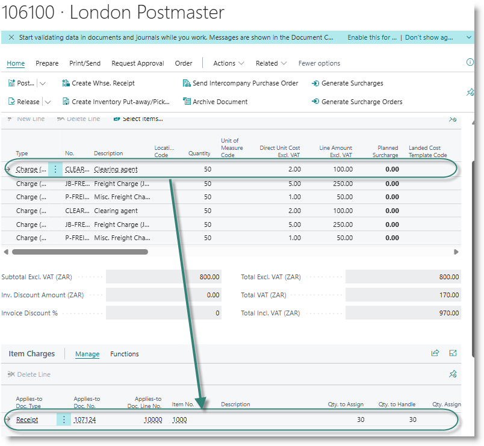

# Landed Cost

## Create landed costs on purchase orders
**Create a new order**
Create a new purchase and capture lines for the items to be purchased, as per normal Business Central processing.

If the item you selected is linked to a landed cost template, the code will be inserted on the order line:

You can amend the code, or insert a template code into lines which are not linked to landed costs templates.

**Generate Surcharges for Landed Cost**
After entering all lines and assigning landed cost templates, click on 'Generate Surcharges':

For each purchase order line which has a landed cost template attached, surcharge lines will be created, using the item charges associated with the template:

The calculation type, calculation rate and preferred vendor will be defaulted from the template. You can amend these if required.

Charges can be added manually to the list if desired.

**Generate Surcharge Orders**
For each surcharge, ensure that a vendor has been captured into the 'Sevice Provide' column.  Click on 'Generate Surcharge Orders'.

For each service provider used on the surcharge lines, a purchase order will be created for later use. The order number is inserted into the column 'Surcharge Purchase Order No.". You can view the orders by clicking on the order number:

## Accrue costs on purchase receipts
When a purchase receipt is posted, to which landed cost surcharges have been attached, the following actions take place, in addition to normal inventory postings:
- A landed cost provision will be posted:
  - Debit Cost of Goods Sold
  - Credit Cost of Goods Sold (interim).
- The associated purchase orders for the service providers will be updated to reflect the quantity received, and applied cost entries will be created.
  

## Posting landed cost invoices

[**⬆️ Back to Top**](#landed-cost) &nbsp;&nbsp;&nbsp;&nbsp; [**🏠 Home**](/trade_assistant)